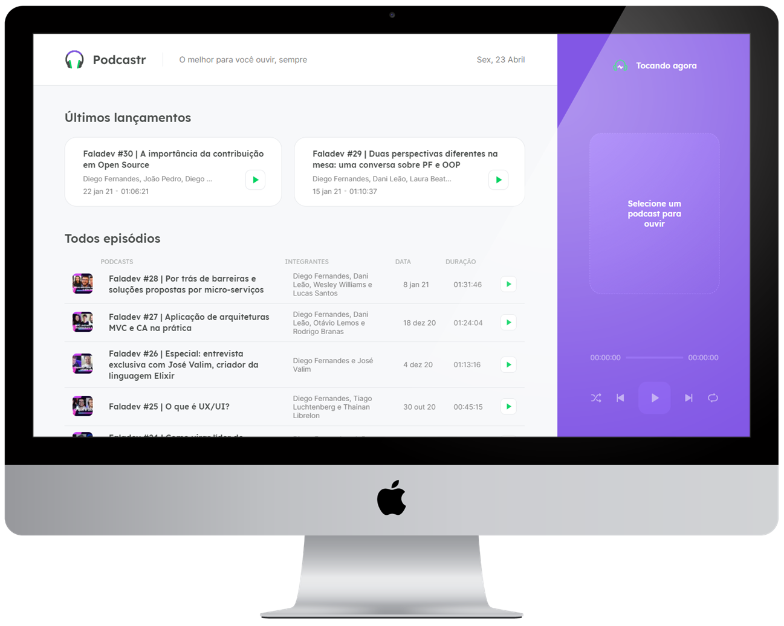

<h1 align="center">
    
</h1>

<p align="center">
  <a href="#desktop_computer-project"></a>&nbsp;
  <a href="#nail_care-layout"></a>&nbsp;
  <a href="#technologist-technologies"></a>
  <p>
  <p align="center">
  <a href="#octocat-environment"></a>&nbsp;
  <a href="#bookmark_tabs-license"></a>&nbsp;
    <a href="#wave-participants"></a>
</p>

<br>

<p align="center">
 
</p>

<br>
<hr>

## :desktop_computer: Project

<strong>Podcastr</strong> is an web application that allows users to listen podcasts.

Application created in [@Rocketseat's](https://github.com/Rocketseat) fifth edition of NextLevelWeek, an online event that occurred on april 19th to 23th, 2021.

> Due to some styling features I recommend using the latest edge, brave or chrome version.

In this application it was possible to deepen knowledge in front-end development, reviewing concepts like: 
<br>

- React-Components,
- React-Props,
- React-Hooks,
- SEO (Search Engine Optimization),
- SPA (Single-page Application), 
- SSR (Server-side Rendering), 
- SSG (Static site Generation), 
- Fake API (Json-server). 
- css-modules & SASS.
- Axios.

<br>
<hr>

## :nail_care: Layout
<p align="center">


</p>

<h3 align="center">Click <a href="https://podcastr-caiolemec.vercel.app/">HERE</a> if you want to see this aplication running.</h3>

<h3 align="center">You can also check completed layout at <a href="https://www.figma.com/file/UwFEntsHpHYJlHNQAQr4gA/Podcastr">FIGMA</a>.</h3>

<br>

<br>
<hr>

## :technologist: Technologies

- [Next.js](https://nextjs.org/)
- [React](https://pt-br.reactjs.org/)
- [Typescript](https://www.typescriptlang.org/)
- [Sass](https://sass-lang.com/)
- [Json Server](https://www.npmjs.com/package/json-server)
- [Axios](https://github.com/axios/axios)

<br>
<hr>

## :octocat: Environment

1. Clone the repository: 
```bash 
git@github.com:CaioLemec/podcastr.git
```
2. Install all dependencies by using command:
```bash
 yarn
 ```
3. At your terminal set this command line to get server running:
```bash
yarn server 
```
4. At your terminal set this command line to get <strong>dev</strong> mode running:
```bash
yarn dev
```
5. You can also check the <strong>build</strong> mode running:
```bash
yarn build
```
6. Access the generated address in your browser:
```bash
http://localhost:3000/
```
<br>
<hr>

## :bookmark_tabs: License

<br>

This project is licensed under the MIT [LICENSE](LICENSE.md).

<br>
<hr>

## :wave: Participants
<br>


<h3>Caio Lemec<h3>
<a href="https://t.me/caiolemec">
<a href="mailto:caiolemec@gmail.com">
<a href="https://www.linkedin.com/in/caiolemec/">
<br>
</p>
